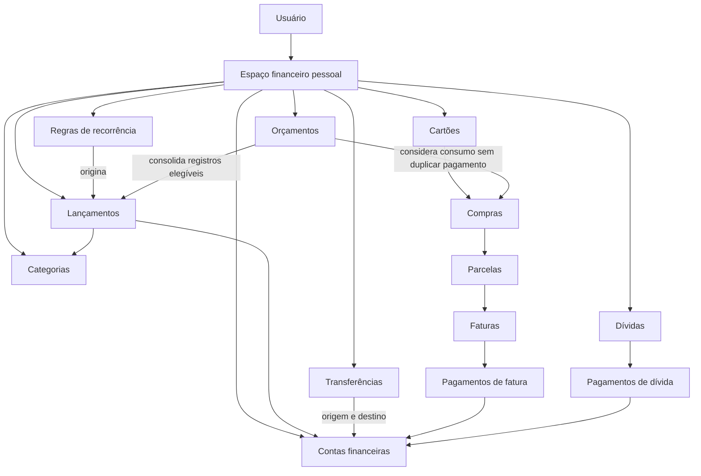

# Modelo conceitual TO-BE do produto PlannerFin

## 1. Escopo do modelo

Este documento descreve como o PlannerFin compreende os conceitos do núcleo financeiro pessoal. Ele substitui, no horizonte TO-BE, a organização por abas, células, fórmulas e bases auxiliares observada no [AS-IS](../research/XLSX-AS-IS-ANALYSIS.md), sem copiar automaticamente seus comportamentos.

Este é um **modelo conceitual de produto**, não um modelo físico de banco de dados. Ele não define tabelas, colunas, chaves, arquivos, armazenamento, framework, ORM, API, endpoints, componentes de interface ou código. A representação técnica será decidida em unidades posteriores, depois das SPECs aplicáveis.

As afirmações usam quatro classificações:

- **[Conceito de produto]** vocabulário e significado adotados para raciocinar sobre o produto, sem prescrever implementação;
- **[Regra aprovada]** comportamento já autorizado pela visão, pelo escopo, pelos princípios ou pela decisão desta unidade documental;
- **[Proposta]** definição TO-BE recomendada para futura aprovação; não autoriza implementação;
- **[Dúvida]** ponto sem evidência ou aprovação suficiente, que deve ser decidido em documento ou SPEC própria.

Propostas e dúvidas não são regras implementáveis. Quando uma SPEC futura transformar uma proposta em comportamento, deverá registrar a decisão, exceções e critérios de aceite.

### 1.1 Princípios aplicados

O modelo mantém uma fonte de verdade por registro, impede dupla contagem, separa valores previstos de realizados e saldo oficial de estimado, torna cálculos rastreáveis, trata transferências sem impacto em receitas e despesas, exige automações revisáveis, preserva o núcleo financeiro independente de IA e parte de configuração inicial manual.

## 2. Contexto financeiro

| Conceito | Definição conceitual | Classificação |
|---|---|---|
| Usuário | Pessoa autenticada que administra as próprias informações financeiras. No MVP, acessa somente seu espaço financeiro pessoal. | **[Regra aprovada]** |
| Espaço financeiro pessoal | Contexto que reúne configurações, registros e consolidações pertencentes ao usuário, sem implicar compartilhamento ou estrutura física específica. | **[Conceito de produto]** |
| Período de competência | Intervalo ao qual uma receita, despesa, compra ou orçamento economicamente pertence, independentemente do pagamento. | **[Proposta]** |
| Período de caixa | Intervalo em que ocorreu entrada ou saída efetiva de recursos em uma conta financeira. | **[Proposta]** |
| Moeda padrão | Moeda de referência escolhida para os valores e consolidações do espaço financeiro pessoal. | **[Proposta]** |
| Precisão monetária | Regra explícita de casas decimais e arredondamento aplicável a valores monetários. | **[Dúvida]** |
| Data de ocorrência | Data do evento econômico, como recebimento, consumo, compra ou contratação, conforme o conceito envolvido. | **[Proposta]** |
| Data de vencimento | Data-limite prevista para pagamento ou recebimento. Não comprova realização. | **[Conceito de produto]** |
| Data de pagamento | Data em que o pagamento ou recebimento foi efetivamente reconhecido. | **[Proposta]** |

**[Regra aprovada]** Datas e períodos relevantes devem ser explícitos; ausência de valor não representa estado financeiro.

**[Dúvida]** A moeda padrão poderá ser alterada depois que houver registros? Como conversões, múltiplas moedas, fuso horário, precisão e arredondamento serão tratados? Essas decisões não são tomadas aqui.

## 3. Configuração inicial manual

**[Regra aprovada]** A configuração inicial é totalmente manual no aplicativo. A planilha legada não participa da carga inicial, nenhum histórico é migrado e nenhum arquivo XLSX é carregado.

O usuário prepara manualmente:

1. contas financeiras;
2. saldo inicial e data de referência de cada conta;
3. categorias de receita e despesa;
4. cartões necessários ao primeiro uso;
5. dívidas e suas posições iniciais conhecidas;
6. orçamento por período e categoria;
7. demais dados exigidos pelos fluxos que decidir configurar.

**[Proposta]** Durante a preparação, os dados iniciais podem ser revisados e editados antes de uma confirmação final. A confirmação identifica o conjunto aceito como ponto de partida, sem transformar o saldo inicial em receita ou despesa.

**[Regra aprovada]** Saldo inicial não é receita. Ele representa a posição conhecida de uma conta em uma data de referência.

**[Proposta]** Correções posteriores devem ocorrer por ajuste rastreável, com origem, justificativa, data de referência e efeito identificáveis; não devem sobrescrever silenciosamente a posição anterior.

**[Dúvida]** A confirmação inicial será única para todo o espaço ou independente por conceito? Quais campos poderão ser corrigidos diretamente e quais exigirão ajuste depois da confirmação?

## 4. Contas financeiras

| Conceito | Definição TO-BE | Classificação |
|---|---|---|
| Conta financeira | Contexto no qual entradas, saídas e transferências alteram uma posição monetária acompanhada pelo usuário. | **[Conceito de produto]** |
| Saldo inicial | Posição informada manualmente para uma conta em uma data de referência; não é receita nem despesa. | **[Regra aprovada]** |
| Saldo calculado | Resultado rastreável do saldo inicial, lançamentos realizados, transferências confirmadas e ajustes aplicáveis até uma data. | **[Proposta]** |
| Ajuste de saldo | Correção explícita da posição da conta, com origem, justificativa, data e efeito preservados. | **[Proposta]** |
| Conta ativa | Conta disponível para novos registros. | **[Proposta]** |
| Conta inativa | Conta preservada para histórico e consolidações passadas, mas indisponível para novos registros ordinários. | **[Proposta]** |

**[Regra aprovada]** Receitas e despesas realizadas afetam a conta associada conforme sua natureza. Uma transferência produz efeitos opostos e vinculados nas contas de origem e destino, sem compor receitas, despesas ou resultado consolidado.

**[Proposta]** Conta com registros vinculados deve ser arquivada ou inativada, não excluída de modo a apagar ou tornar órfão o histórico. Exclusão poderá ser admitida apenas quando não houver efeitos financeiros, mediante confirmação explícita.

**[Dúvida]** Quais tipos de conta existirão, quais estados precedem a realização e como funcionam saldo negativo, conciliação, reabertura e exclusão de uma conta nunca utilizada?

## 5. Categorias

| Conceito | Definição TO-BE | Classificação |
|---|---|---|
| Categoria de receita | Classificação aplicável a receitas e incompatível com despesas. | **[Proposta]** |
| Categoria de despesa | Classificação aplicável a despesas e incompatível com receitas. | **[Proposta]** |
| Categoria de sistema | Categoria fornecida pelo produto para um tratamento explicitamente especificado; não deve ser criada apenas para reproduzir uma fórmula legada. | **[Proposta]** |
| Categoria personalizada | Categoria criada manualmente pelo usuário dentro de uma natureza definida. | **[Proposta]** |
| Categoria ativa | Categoria disponível para novos registros e planejamento. | **[Proposta]** |
| Categoria inativa | Categoria indisponível para novos usos, mas preservada nos registros históricos. | **[Proposta]** |

**[Regra aprovada]** As categorias da planilha não são reproduzidas automaticamente. O cadastro inicial é manual.

**[Proposta]** Renomear uma categoria atualiza sua identificação autoritativa sem perder a rastreabilidade. Inativá-la não recategoriza lançamentos anteriores. Trocar a natureza de uma categoria já utilizada ou excluir uma categoria com histórico exige decisão específica, pois pode alterar consolidações.

**[Dúvida]** Haverá categorias de sistema obrigatórias? Categorias poderão ter hierarquia, classificação de essencialidade ou vigência temporal? Como ocorrerá a recategorização em massa?

## 6. Lançamentos

**[Conceito de produto]** Lançamento é o registro autoritativo de uma receita ou despesa, com natureza explícita. Ele contém, conforme aplicável: data de ocorrência, vencimento, pagamento, competência, conta financeira, categoria, descrição, valor, estado e histórico de alteração.

- **Receita:** entrada econômica classificada como receita; só afeta caixa quando realizada em uma conta.
- **Despesa:** saída econômica classificada como despesa; só afeta caixa quando realizada em uma conta.
- **Previsão:** expectativa registrada, ainda não realizada.
- **Pendência:** obrigação ou direito existente que aguarda realização ou encerramento.
- **Realização:** reconhecimento explícito de recebimento ou pagamento, com data e conta aplicáveis.
- **Cancelamento:** encerramento sem realização, preservando a existência e a justificativa do registro.
- **Vencimento:** data-limite prevista, sem equivaler a pagamento.
- **Pagamento:** realização financeira que produz saída de caixa; para receita, o termo correspondente é recebimento.
- **Competência:** período de atribuição econômica do lançamento.

**[Proposta]** Conjunto inicial para discussão: `previsto`, `pendente`, `realizado` e `cancelado`. `Vencido` pode ser uma condição derivada de um lançamento pendente cuja data de vencimento passou, em vez de um estado autoritativo.

**[Regra aprovada]** Pago e pendente devem ser explícitos. Célula vazia, ausência de texto, emoji ou inferência visual não representa estado. Valores previstos e realizados permanecem distinguíveis.

**[Proposta]** Toda alteração relevante preserva autor, momento, valor anterior, valor novo e justificativa quando exigida pelo risco. Cancelamento não apaga o registro.

**[Dúvida]** A lista oficial de estados, transições, condições derivadas, realização parcial, agendamento, atraso, estorno, edição retroativa e exigências de histórico será aprovada em SPEC própria.

## 7. Transferências

**[Regra aprovada]** Transferência é uma única operação conceitual entre duas contas financeiras do mesmo espaço. Possui conta de origem, conta de destino, valor, data, estado e efeitos vinculados nas duas contas.

Quando realizada, a transferência:

- reduz o saldo calculado da conta de origem;
- aumenta o saldo calculado da conta de destino;
- não é receita;
- não é despesa;
- não altera o resultado financeiro consolidado;
- deve ser rastreável a partir de ambas as contas;
- participa uma única vez de qualquer consolidação que apresente transferências.

**[Regra aprovada]** Os efeitos nas contas não constituem duas operações econômicas independentes. A representação física não é definida neste documento.

**[Proposta]** O estado da operação controla conjuntamente seus dois efeitos, impedindo que somente um lado seja confirmado ou cancelado.

**[Dúvida]** Estados, agendamento, cancelamento após realização, transferências entre moedas, tarifas e tratamento de data divergente entre contas exigem decisão futura.

## 8. Cartões, compras, parcelas e faturas

| Conceito | Definição TO-BE | Classificação |
|---|---|---|
| Cartão | Instrumento cadastrado para organizar compras, limite e ciclos de fatura; não é conta financeira por si só. | **[Proposta]** |
| Compra | Evento de consumo ou despesa associado a um cartão. | **[Proposta]** |
| Parcelamento | Acordo que distribui o valor de uma compra em parcelas. | **[Conceito de produto]** |
| Parcela | Fração identificável de uma compra parcelada, associada a uma competência ou fatura conforme regra futura. | **[Proposta]** |
| Fatura | Consolidação rastreável de parcelas, compras, estornos, pagamentos e encargos atribuídos a um ciclo de cartão. | **[Proposta]** |
| Fechamento | Marco que delimita o conjunto do ciclo, sem apagar alterações posteriores rastreáveis. | **[Proposta]** |
| Vencimento da fatura | Data-limite esperada para pagamento da fatura. | **[Conceito de produto]** |
| Pagamento de fatura | Saída de caixa de uma conta pagadora vinculada à fatura. | **[Proposta]** |
| Pagamento parcial | Pagamento inferior ao valor exigível, cujo efeito residual depende de regra futura. | **[Dúvida]** |
| Estorno | Reversão total ou parcial vinculada ao evento que corrige. | **[Proposta]** |
| Encargo | Acréscimo atribuído ao cartão ou à fatura, com origem e natureza explícitas. | **[Proposta]** |

**[Proposta TO-BE contra dupla contagem]** Compras representam consumo ou despesa; o pagamento da fatura representa saída de caixa da conta pagadora. Cada relatório declara se apresenta consumo, competência ou caixa. Quando as compras já compõem despesas, o pagamento da fatura não é somado novamente como nova despesa. A fatura consolida origens rastreáveis e não substitui silenciosamente as compras.

**[Dúvida]** Permanecem pendentes o momento exato de realização da despesa, a relação entre competência e caixa, pagamento parcial, estornos, encargos, atraso, reabertura de fatura e alocação de parcelas em ciclos. Nenhuma fórmula definitiva é aprovada aqui.

## 9. Dívidas

| Conceito | Definição TO-BE | Classificação |
|---|---|---|
| Dívida | Obrigação financeira acompanhada pelo usuário. | **[Conceito de produto]** |
| Credor | Pessoa ou organização perante a qual existe a obrigação. | **[Conceito de produto]** |
| Valor contratado | Valor principal reconhecido na contratação, sem presumir que seja o saldo atual. | **[Proposta]** |
| Saldo oficial | Posição informada ou conciliada como oficial em uma data de referência. | **[Regra aprovada]** |
| Data de referência do saldo oficial | Data à qual o saldo oficial se aplica. | **[Proposta]** |
| Saldo estimado | Projeção separada, calculada por premissas explícitas e nunca apresentada como saldo oficial. | **[Regra aprovada]** |
| Pagamento | Evento vinculável à dívida que registra valor efetivamente pago. | **[Proposta]** |
| Parcela | Componente previsto ou devido do acordo, sem substituir a evidência do pagamento. | **[Proposta]** |
| Amortização | Parte do pagamento que reduz principal, quando essa decomposição for conhecida. | **[Proposta]** |
| Juros | Custo financeiro associado ao tempo ou às condições do acordo. | **[Conceito de produto]** |
| Encargos | Acréscimos diferentes do principal, identificados por origem. | **[Proposta]** |
| Renegociação | Mudança rastreável das condições da obrigação, sem apagar o acordo anterior. | **[Proposta]** |
| Quitação | Encerramento confirmado da obrigação segundo critério a ser especificado. | **[Proposta]** |

**[Regra aprovada]** O saldo oficial nunca é substituído silenciosamente por estimativa. Pagamentos devem poder ser vinculados à dívida e também podem afetar uma conta financeira. O total pago deriva dos pagamentos vinculados e de eventual posição inicial informada manualmente. Alterações do saldo oficial preservam histórico. Número de parcelas marcadas como pagas não substitui o valor realmente pago.

**[Proposta]** Um pagamento que afeta conta e dívida é um evento rastreável entre os dois conceitos, sem duplicar a saída de caixa.

**[Dúvida]** Juros, encargos, amortização, renegociação, quitação, atraso e estimativas exigem regras aprovadas. Este documento não escolhe fórmula financeira.

## 10. Orçamento

**[Conceito de produto]** Orçamento registra, para um período e uma categoria, um valor planejado e permite compará-lo ao valor realizado rastreável. A variação expressa a diferença entre essas grandezas, sem modificar os registros de origem.

- **Período:** intervalo ao qual o planejamento se aplica;
- **Categoria:** classificação do valor planejado e dos registros comparáveis;
- **Valor planejado:** limite ou expectativa informada pelo usuário;
- **Valor realizado:** consolidação dos registros elegíveis segundo regra explícita;
- **Variação:** diferença identificada entre planejado e realizado.

**[Proposta]** Compras no cartão entram no orçamento uma única vez segundo a visão de consumo ou competência aprovada; o pagamento da fatura é excluído quando as compras já foram consideradas. Transferências são excluídas. Valores pendentes permanecem separados do realizado e podem ser mostrados como comprometidos, se esse conceito for aprovado.

**[Dúvida]** Regime, tratamento de pendências, compras parceladas, devoluções, categorias alteradas e fórmula/sinal da variação serão definidos em SPEC.

## 11. Recorrências

**[Conceito de produto]** Regra de recorrência descreve a intenção de produzir ocorrências financeiras relacionadas ao longo do tempo. Ela não é, por si só, receita, despesa ou realização.

| Elemento | Definição proposta |
|---|---|
| Ocorrência | Lançamento identificável originado de uma regra, editável conforme política futura. |
| Frequência | Cadência prevista entre ocorrências. |
| Início | Primeira data de vigência da regra. |
| Fim | Limite opcional de vigência. |
| Próxima geração | Próxima data elegível para propor ou criar uma ocorrência. |
| Edição de uma ocorrência | Alteração restrita a um item, preservando o vínculo com a regra. |
| Edição das próximas | Mudança da regra para ocorrências futuras, sem reescrever silenciosamente o passado. |
| Cancelamento | Encerramento explícito de uma ocorrência ou da regra, conforme escopo confirmado. |

**[Regra aprovada]** Automações são revisáveis: ocorrências e alterações geradas devem ser identificáveis, inspecionáveis e corrigíveis. O núcleo de recorrência não depende de IA.

**[Dúvida]** Devem ser definidos geração antecipada, vencimentos em dias inexistentes, efeito da alteração de uma ocorrência, alcance da alteração das próximas, cancelamento e comportamento durante falta de conexão.

## 12. Relações conceituais

### 12.1 Tabela de relações

| Origem | Relação | Destino | Regra conceitual |
|---|---|---|---|
| Usuário | administra | Espaço financeiro pessoal | No MVP, o uso é pessoal. |
| Espaço financeiro pessoal | reúne | Contas, categorias, cartões, dívidas e orçamentos | Cada registro possui fonte de verdade identificável. |
| Conta financeira | recebe efeitos de | Lançamentos realizados | Receita aumenta e despesa reduz o saldo conforme regra aprovada. |
| Transferência | conecta | Conta de origem e conta de destino | Efeitos opostos, vinculados e neutros no resultado. |
| Lançamento | usa | Categoria | A natureza da categoria deve ser compatível. |
| Regra de recorrência | origina | Ocorrências | A origem automática permanece rastreável. |
| Cartão | organiza | Compras e faturas | Compra e pagamento têm papéis diferentes. |
| Compra parcelada | origina | Parcelas | A soma e os arredondamentos exigem regra futura. |
| Fatura | consolida | Compras, parcelas, estornos e encargos | As origens não são duplicadas como nova despesa. |
| Pagamento de fatura | afeta | Conta pagadora e fatura | Uma saída de caixa vinculada, não nova despesa se compras já contabilizadas. |
| Dívida | recebe | Pagamentos e atualizações de saldo oficial | Histórico e vínculos são preservados. |
| Orçamento | compara | Planejado e realizado por período/categoria | O realizado deriva de registros elegíveis. |

### 12.2 Diagrama conceitual

O diagrama expressa relações de produto, não cardinalidades, tabelas, chaves ou direção de dependências técnicas.

### 12.3 Exemplos de fluxos completos

Todos os valores abaixo são sintéticos e servem apenas para explicar relações.

1. **Configuração manual inicial de uma conta:** o usuário cria manualmente “Conta cotidiana”, informa a moeda padrão e a mantém editável até confirmar a configuração.
2. **Informação de saldo inicial:** informa saldo sintético de 1.000,00 com data de referência; o valor inicia a posição da conta e não entra em receitas.
3. **Receita recebida:** registra receita de 200,00, com categoria, conta e data de recebimento; após realização, o saldo calculado aumenta e a receita integra a consolidação aplicável.
4. **Despesa pendente e depois paga:** registra despesa de 80,00 com vencimento; enquanto pendente, compõe contas a pagar, não a saída realizada. Ao pagar, registra data e conta, e o saldo calculado diminui uma vez.
5. **Transferência entre contas:** transfere 150,00 da conta cotidiana para uma conta de reserva; as posições mudam em sentidos opostos e receitas, despesas e resultado não mudam.
6. **Compra parcelada no cartão:** registra compra sintética de 300,00 em três parcelas; compra, parcelamento e parcelas permanecem relacionados, e a regra futura define competência e realização sem duplicar o total.
7. **Fechamento e pagamento de fatura:** a fatura consolida parcelas elegíveis; seu pagamento reduz a conta pagadora, mas não cria nova despesa quando o consumo já está no relatório.
8. **Pagamento de parcela de dívida:** registra pagamento sintético de 120,00 vinculado à dívida e à conta pagadora; a saída de caixa ocorre uma vez e o total pago da dívida usa esse vínculo.
9. **Atualização do saldo oficial de uma dívida:** o usuário informa novo saldo oficial com data e origem; o valor anterior continua no histórico e nenhuma estimativa é sobrescrita como oficial.
10. **Ajuste rastreável do saldo de uma conta:** ao encontrar divergência de 10,00, registra ajuste com data, origem e justificativa; o saldo calculado muda sem reclassificar o ajuste automaticamente como receita ou despesa.

## 13. Consolidações

| Consolidação | Registros de origem | Registros excluídos | Risco de dupla contagem | Decisão futura necessária |
|---|---|---|---|---|
| Saldo de conta | Saldo inicial; receitas/despesas realizadas; efeitos de transferências; ajustes aplicáveis | Previsões e pendências sem efeito de caixa; registros cancelados | Contar os dois lados de uma transferência na mesma conta ou duplicar ajuste e lançamento | Estados elegíveis, data de corte e tratamento de ajuste |
| Receitas | Lançamentos de receita elegíveis no regime declarado | Transferências; saldo inicial; ajustes sem natureza de receita; cancelados | Tratar saldo inicial ou entrada de transferência como receita | Caixa versus competência e realização parcial |
| Despesas | Lançamentos ou compras elegíveis no regime declarado | Transferências; saldo inicial; pagamento de fatura já representado pelas compras; cancelados | Somar compra e pagamento da fatura | Momento de realização, parcelas, estornos e encargos |
| Resultado | Receitas menos despesas sob o mesmo regime e período | Transferências e movimentos patrimoniais não classificados como receita/despesa | Misturar regimes ou reincluir pagamentos consolidados | Regime oficial, sinais e períodos |
| Contas a pagar | Despesas pendentes vencidas ou a vencer | Realizadas, canceladas e receitas | Manter item pago como pendente | Estados, pagamentos parciais e atraso |
| Contas a receber | Receitas pendentes vencidas ou a vencer | Realizadas, canceladas e despesas | Contar previsão não confirmada e pendência como itens diferentes | Distinção entre previsão e direito a receber |
| Consumo em cartão | Compras/parcelas elegíveis, líquidas de estornos conforme regra | Pagamentos de fatura e transferências | Contar valor total e parcelas simultaneamente | Compra versus parcela, competência e estorno |
| Saída de caixa por pagamento de fatura | Pagamentos vinculados à fatura e à conta pagadora | Compras e parcelas enquanto consumo | Somar novamente como despesa | Pagamento parcial, encargos e atraso |
| Saldo de dívida | Último saldo oficial e, separadamente, estimativa rastreável | Número de parcelas como substituto de valores; estimativa apresentada como oficial | Deduzir pagamento e também substituir saldo sem data coerente | Fórmulas, amortização, juros, renegociação e conciliação |
| Orçamento realizado | Receitas/despesas ou consumo elegíveis por período e categoria | Transferências; pendências quando a visão for realizada; pagamento de fatura duplicado | Combinar compra e fatura ou caixa e competência | Regime, cartões, pendências e recategorização |

**[Regra aprovada]** Toda consolidação informa período, critério, registros incluídos e exclusões relevantes, permitindo reconciliar o total com suas origens.

## 14. Decisões pendentes

As questões abaixo não são resolvidas por este modelo e bloqueiam regras definitivas nas respectivas SPECs:

1. **Estados financeiros oficiais:** lista, transições, condições derivadas, estados parciais e confirmações.
2. **Regime de caixa versus competência:** visão oficial ou convivência entre visões, datas e reconciliação.
3. **Compra no cartão:** momento de realização, atribuição de competência e relação com parcelas e faturas.
4. **Pagamento parcial de fatura:** saldo residual, estado, atraso, encargos e consolidações.
5. **Saldo inicial e ajustes:** confirmação, edição posterior, natureza, conciliação e efeitos nos relatórios.
6. **Juros e estimativas de dívida:** premissas, periodicidade, amortização, arredondamento e distinção do saldo oficial.
7. **Edição de recorrências:** uma ocorrência, próximas ocorrências, passado, geração antecipada e cancelamento.
8. **Estornos e cancelamentos:** efeitos por conceito, período, vínculo com origem e reabertura.
9. **Histórico financeiro:** eventos que exigem autor, data, justificativa, valores anterior/novo e retenção.
10. **Moeda e precisão:** moeda padrão, múltiplas moedas, conversão, casas decimais e arredondamento.
11. **Arquivamento e exclusão:** condições para contas, categorias, cartões, dívidas e registros sem histórico.
12. **Conectividade:** comportamento das automações e confirmações durante interrupções, sem definir arquitetura offline.
