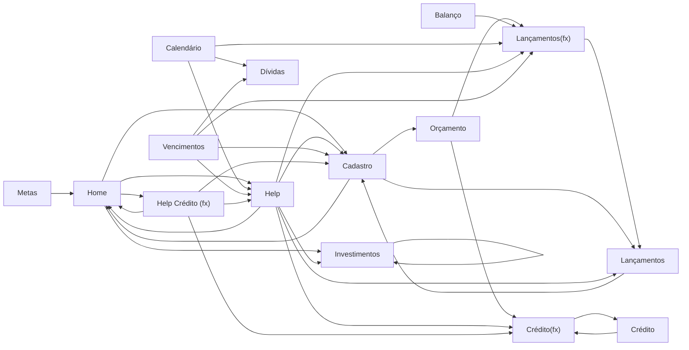

# Análise AS-IS da planilha PlannerFin v5 — 2026

## 1. Escopo, fonte e convenções desta análise

Este documento descreve o funcionamento **atual** do arquivo `Cópia de PlannerFin v5 - 2026.xlsx`. Ele não propõe arquitetura, não especifica uma aplicação futura e não corrige a planilha.

A inspeção cobriu as 16 abas, inclusive as 5 ocultas, além de fórmulas, fórmulas compartilhadas/matriciais, valores em cache, validações de dados, tabelas, gráficos, imagens, comentários, nomes definidos, pivôs e relacionamentos internos do pacote XLSX. A leitura visual foi feita em todas as abas. Valores pessoais e identificadores presentes nos cadastros foram deliberadamente omitidos, pois não são necessários para explicar a regra de negócio.

Classificação das afirmações:

- **[Fato observado]**: consta diretamente das células, fórmulas, validações, objetos ou estrutura XML do arquivo analisado.
- **[Hipótese]**: interpretação plausível, mas não confirmada pelo arquivo.
- **[Dúvida]**: decisão ou confirmação necessária do proprietário do produto.

Ao citar fórmulas, os nomes foram preservados ou simplificados apenas para legibilidade. Fórmulas exportadas do Google Sheets aparecem no XLSX encapsuladas em `__xludf.DUMMYFUNCTION(...)`; isso é indicado quando relevante.

## 2. Visão geral do arquivo

| Aba | Visibilidade | Papel observado | Fórmulas observadas |
|---|---|---|---:|
| Home | Visível | Painel principal e navegação | 183 |
| NotificaFin | Visível | Formulário visual de notificações | 0 |
| Orçamento | Visível | Orçamento mensal planejado x realizado | 3.456 |
| Metas | Visível | Cadastro manual e acompanhamento de metas | 77 |
| Lançamentos | Visível | Base de receitas e despesas | 1 fórmula matricial |
| Crédito | Visível | Compras no cartão e resumo de fatura | 1 |
| Investimentos | Visível | Entradas, saídas e saldo por classe | 424 |
| Balanço | Visível | Receitas, despesas e resultado por mês/ano | 273 |
| Lançamentos(fx) | Oculta | Base derivada de lançamentos | 1 fórmula de consulta/matriz |
| Calendário | Visível | Agenda mensal de compromissos | 37 |
| Dívidas | Visível | Controle de dívidas e parcelas | 47 |
| Cadastro | Visível | Cadastros mestres e preferências | 109 |
| Help | Oculta | Cálculos e fontes de gráficos/pivôs | 145 |
| Crédito(fx) | Oculta | Base derivada de compras no cartão | 1 fórmula de consulta/matriz |
| Vencimentos | Oculta | Base derivada de notificações | 15 |
| Help Crédito (fx) | Oculta | Cálculos de faturas/cartões para o painel | 6.596 |

### 2.1 Constatações transversais

- **[Fato observado]** A planilha foi estruturada com funções típicas do Google Sheets, como `QUERY`, `FILTER`, `UNIQUE`, `SPARKLINE`, `IMAGE` e literais de matriz. No XLSX, várias delas foram exportadas como `__xludf.DUMMYFUNCTION(...)`.
- **[Fato observado]** As duas bases auxiliares principais, `Lançamentos(fx)` e `Crédito(fx)`, têm `#VALUE!` em suas fórmulas-âncora no valor em cache do arquivo. Três consultas da aba `Help` também têm `#VALUE!`.
- **[Fato observado]** Foram encontrados valores de erro em cache: 828 `#DIV/0!` em `Orçamento`; 1 `#VALUE!` em cada uma de `Lançamentos(fx)` e `Crédito(fx)`; 2 `#REF!`, 3 `#VALUE!` e 4 `#DIV/0!` em `Help`; 2 `#VALUE!` e 1.994 `#DIV/0!` em `Help Crédito (fx)`.
- **[Fato observado]** Há dois relacionamentos XML inválidos nos caches de tabela dinâmica: ambos declaram uma relação externa sem `Id` e sem destino. Os dois arquivos de comentários têm autor vazio. Esses problemas impediram a importação integral do arquivo por um leitor XLSX estrito.
- **[Fato observado]** O arquivo contém muitos intervalos pré-alocados: quase 10 mil linhas nas telas de lançamento e cartão e milhares de linhas nas bases auxiliares.
- **[Fato observado]** Não há projeto VBA/macros no pacote XLSX. Há, porém, objetos visuais que sugerem ações, como “Adicionar Compra”.
- **[Hipótese]** A experiência funcional de referência é o Google Sheets; a cópia XLSX parece ser um artefato de exportação e não uma versão plenamente compatível com Excel.
- **[Dúvida]** O Google Sheets é a fonte de verdade operacional ou o XLSX também precisa recalcular corretamente no Excel?

## 3. Mapa de dependências entre abas

Na tabela e no diagrama abaixo, `A → B` significa que **A contém fórmula que referencia B**. Navegação por hyperlink/objeto não é contabilizada como dependência de cálculo.

| Aba dependente | Abas referenciadas diretamente | Quantidade de referências de fórmula |
|---|---|---:|
| Balanço | Lançamentos(fx) | 168 |
| Cadastro | Home; Lançamentos; Orçamento | 40; 18; 41 |
| Calendário | Dívidas; Help; Lançamentos(fx) | 12; 12; 13 |
| Crédito | Crédito(fx) | 1 |
| Crédito(fx) | Crédito | 1 |
| Help | Cadastro; Crédito(fx); Home; Investimentos; Lançamentos; Lançamentos(fx) | 7; 49; 2; 1; 1; 60 |
| Help Crédito (fx) | Cadastro; Crédito(fx); Help; Home | 997; 308; 154; 998 |
| Home | Cadastro; Help; Help Crédito (fx); Investimentos | 2; 106; 34; 1 |
| Lançamentos | Cadastro | 1 |
| Lançamentos(fx) | Lançamentos | 1 |
| Metas | Home | 2 |
| Orçamento | Crédito(fx); Lançamentos(fx) | 1.080; 1.080 |
| Vencimentos | Cadastro; Dívidas; Help; Lançamentos(fx) | 1; 1; 1; 1 |

**[Fato observado]** O mapa por aba contém ciclos (`Crédito` ↔ `Crédito(fx)`, `Lançamentos` ↔ `Lançamentos(fx)`, `Home` ↔ `Cadastro`/`Help`/`Help Crédito (fx)`). Isso não prova uma referência circular entre células: as referências podem atingir regiões independentes dentro de cada aba.

## 4. Análise por aba

### 4.1 Home

1. **Finalidade** — **[Fato observado]** Painel de entrada, navegação e consolidação de patrimônio, receitas, despesas, orçamento, cartões e categorias. Contém links visuais para as demais áreas funcionais.
2. **Campos editáveis pelo usuário** — **[Fato observado]** `BE2` seleciona o mês (`Jan` a `Dez`) e `BI2` seleciona o ano (`2024` a `2035`). São os únicos controles com validação de dados claramente identificados na aba.
3. **Campos calculados** — **[Fato observado]** Patrimônio total, total investido, saldo em contas, receitas, despesas, previstos, saldo do mês, orçamento, orçamento restante, resumos por cartão/categoria, textos de insight e indicadores visuais.
4. **Fórmulas relevantes** — **[Fato observado]** `Patrimônio Total = Investimentos + Saldo em Contas`; o total investido referencia `Investimentos!C7`; o saldo em contas e os totais mensais vêm de `Help`; o orçamento vem de `Cadastro!F4`; o restante é `Orçamento - Despesas`. Há 25 fórmulas de `SPARKLINE` exportadas como `DUMMYFUNCTION`.
5. **Dependências com outras abas** — **[Fato observado]** Depende diretamente de `Cadastro`, `Help`, `Help Crédito (fx)` e `Investimentos`. Também funciona como origem dos filtros de mês/ano usados por várias abas auxiliares.
6. **Entidades de negócio identificadas** — **[Fato observado]** Patrimônio, conta, investimento, receita, despesa, orçamento, cartão, fatura, categoria e período.
7. **Regras de negócio implícitas** — **[Fato observado]** O saldo mensal é receita menos despesa; o orçamento restante é orçamento menos despesa; os textos de insight são escolhidos conforme categorias de maior gasto; a saudação depende do horário e do nome cadastrado.
8. **Possíveis inconsistências** — **[Fato observado]** O resumo pode exibir zeros ou informações incompletas quando as consultas ocultas não recalculam. Um gráfico de área anual existe no pacote, mas sua série não foi recuperada na estrutura analisada.
9. **Recursos aparentemente duplicados** — **[Fato observado]** Há 38 imagens/ícones na aba, com vários recursos visuais repetidos. Alguns totais exibidos são novamente materializados em `Help` e `Help Crédito (fx)`.
10. **Limitações** — **[Fato observado]** Forte acoplamento a abas ocultas; indicadores `SPARKLINE` não são nativos no Excel exportado; os seletores de período não controlam uniformemente todas as fórmulas do arquivo, pois há anos fixos em outras abas.

### 4.2 NotificaFin

1. **Finalidade** — **[Fato observado]** Tela visual para “Notificação Whatsapp”, e-mail de compra, número de WhatsApp, antecedência da notificação e uma lista com descrição, valor e dia de vencimento.
2. **Campos editáveis pelo usuário** — **[Fato observado]** Os rótulos indicam campos para e-mail, WhatsApp e quantidade de dias, mas não há validações nem fórmulas que permitam delimitar com segurança as células de entrada.
3. **Campos calculados** — **[Fato observado]** Nenhum campo calculado foi encontrado.
4. **Fórmulas relevantes** — **[Fato observado]** A aba não contém fórmulas.
5. **Dependências com outras abas** — **[Fato observado]** Não referencia nem é referenciada por fórmulas de outras abas. `Home` apenas oferece navegação visual para ela.
6. **Entidades de negócio identificadas** — **[Fato observado]** Notificação, e-mail de compra, telefone/WhatsApp, antecedência, descrição, valor e vencimento.
7. **Regras de negócio implícitas** — **[Hipótese]** A antecedência em dias seria usada para avisar sobre vencimentos. Nenhuma regra de disparo foi encontrada no arquivo.
8. **Possíveis inconsistências** — **[Fato observado]** Os mesmos conceitos de e-mail e antecedência aparecem em `Cadastro`, enquanto a base de itens a notificar aparece em `Vencimentos`; não existe ligação por fórmula entre essas partes e `NotificaFin`.
9. **Recursos aparentemente duplicados** — **[Fato observado]** Configuração de notificação duplicada visualmente entre esta aba e `Cadastro`; a lista de vencimentos tem sobreposição conceitual com a aba oculta `Vencimentos`.
10. **Limitações** — **[Fato observado]** A aba é estática no arquivo analisado. **[Dúvida]** Existe automação externa do Google Sheets, como Apps Script, que não acompanha o XLSX?

### 4.3 Orçamento

1. **Finalidade** — **[Fato observado]** Planejar e comparar, mês a mês, despesas por categoria, distinguindo blocos de categorias e exibindo planejado, realizado, atingimento e percentual sobre a receita.
2. **Campos editáveis pelo usuário** — **[Fato observado]** Valores mensais de receita no bloco `B:C` e células amarelas de “Planejado” distribuídas nos 12 blocos mensais. Não há validação de dados nesses campos.
3. **Campos calculados** — **[Fato observado]** Realizado por categoria, percentual de atingimento, participação na receita, totais mensais e sobra mensal.
4. **Fórmulas relevantes** — **[Fato observado]** O realizado soma lançamentos pagos e compras no crédito, por mês/ano/categoria. Forma resumida: `SUMIFS(Lançamentos(fx), status="✅ Pago", mês, ano=2026, categoria) + SUMIFS(Crédito(fx), categoria<>"🧾 Fatura do Cartão", mês, ano=2026, categoria)`. O atingimento usa `IFERROR(Realizado/Planejado,0)`. A sobra mensal é `Receita planejada - Total planejado`.
5. **Dependências com outras abas** — **[Fato observado]** Depende de `Lançamentos(fx)` e `Crédito(fx)`. Seus valores planejados alimentam `Cadastro`, que os expõe a `Home` e `Help`.
6. **Entidades de negócio identificadas** — **[Fato observado]** Orçamento mensal, receita planejada, despesa planejada, despesa realizada, categoria, categoria essencial/não essencial, atingimento e participação sobre receita.
7. **Regras de negócio implícitas** — **[Fato observado]** Só lançamentos com status exato `✅ Pago` entram no realizado; compras individuais de cartão entram diretamente, mas a categoria agregadora `🧾 Fatura do Cartão` é excluída para evitar dupla contagem; o ano usado nas 1.080 fórmulas de realizado é 2026.
8. **Possíveis inconsistências** — **[Fato observado]** Há 828 `#DIV/0!` em cache nas colunas de percentual sobre receita para linhas sem base de divisão. O ano 2026 está fixo, apesar do seletor de ano na `Home`. O arquivo mantém dois eixos mensais: lista de receitas em `B:C` e 12 blocos horizontais.
9. **Recursos aparentemente duplicados** — **[Fato observado]** O mesmo conjunto de categorias e as quatro métricas se repetem 12 vezes. O realizado é recalculado por célula com fórmulas quase idênticas, em vez de uma única base agregada visível.
10. **Limitações** — **[Fato observado]** Layout muito largo (`BB`), 3.456 fórmulas, `SUMIFS` sobre colunas inteiras e dependência de duas consultas ocultas incompatíveis no cache do XLSX. Não há seleção de ano na própria aba.

### 4.4 Metas

1. **Finalidade** — **[Fato observado]** Registrar e acompanhar metas financeiras em até 15 cartões visuais.
2. **Campos editáveis pelo usuário** — **[Fato observado]** Em cada cartão: nome, valor da meta, valor a guardar por mês, total já guardado e URL da imagem. Esses campos são constantes no arquivo, não fórmulas.
3. **Campos calculados** — **[Fato observado]** Progresso, valor faltante, meses restantes e barras/indicadores visuais; total consolidado guardado e comparação com patrimônio.
4. **Fórmulas relevantes** — **[Fato observado]** `Progresso = Total guardado / Meta`; `Falta = Meta - Total guardado`; `Meses restantes = Falta / Guardar no mês`; `IMAGE(URL)` e `SPARKLINE(...)` estão encapsuladas em `DUMMYFUNCTION`. `IFERROR(...,0)` trata divisões inválidas.
5. **Dependências com outras abas** — **[Fato observado]** Referencia `Home` para patrimônio/total consolidado. Não há referência direta a lançamentos, contas ou investimentos.
6. **Entidades de negócio identificadas** — **[Fato observado]** Meta, objetivo, aporte mensal, valor acumulado, valor faltante, prazo e imagem.
7. **Regras de negócio implícitas** — **[Fato observado]** O prazo é uma divisão linear do valor faltante pelo aporte mensal, sem rendimento, inflação ou data-alvo. O total guardado é informado manualmente.
8. **Possíveis inconsistências** — **[Fato observado]** Quando “Guardar no mês” é zero ou vazio, `IFERROR` resulta em zero meses restantes, o que pode ter significado ambíguo. **[Dúvida]** Zero significa “sem previsão” ou “meta concluída”?
9. **Recursos aparentemente duplicados** — **[Fato observado]** O mesmo cartão de meta e o mesmo conjunto de fórmulas se repetem 15 vezes.
10. **Limitações** — **[Fato observado]** Sem vínculo automático com ativos ou transações; quantidade e layout fixos; dependência de imagens externas e funções visuais do Google Sheets; nenhuma validação de entrada.

### 4.5 Lançamentos

1. **Finalidade** — **[Fato observado]** Base principal de receitas e despesas realizadas ou previstas.
2. **Campos editáveis pelo usuário** — **[Fato observado]** De `B` a `K`: data do lançamento, data de vencimento, descrição, indicador “Fixa”, conta, categoria, natureza (`Despesa`/`Receita`), valor e status. A coluna `F`, entre “Fixa” e “Conta”, é preenchida automaticamente. As linhas preparadas vão até 9.996.
3. **Campos calculados** — **[Fato observado]** A coluna `F` é uma fórmula matricial que procura, em `Cadastro`, o atributo/ícone associado à conta selecionada.
4. **Fórmulas relevantes** — **[Fato observado]** Em `F6`, uma fórmula matricial equivalente a `IFERROR(IF(G6:G9996<>"",VLOOKUP(G6:G9996,Cadastro!M:N,2,FALSE),""),"")` preenche toda a coluna.
5. **Dependências com outras abas** — **[Fato observado]** Depende de `Cadastro` para contas e categorias. É a origem de `Lançamentos(fx)`, que por sua vez alimenta relatórios.
6. **Entidades de negócio identificadas** — **[Fato observado]** Lançamento, vencimento, recorrência/fixo, conta, categoria, receita, despesa, valor e status.
7. **Regras de negócio implícitas** — **[Fato observado]** Conta deve vir de `Cadastro!M6:M23`; categoria de `Cadastro!B6:B120`; natureza aceita `Despesa` ou `Receita`; o único valor permitido explicitamente no status é `✅ Pago`, ficando “pendente” representado por célula vazia.
8. **Possíveis inconsistências** — **[Fato observado]** A validação de natureza começa na linha 7, enquanto as demais começam na linha 6. A base derivada lê até a linha 38.996, mas a área preparada/filtrada desta aba termina em 9.996. O campo “Fixa” não gera recorrências por fórmula.
9. **Recursos aparentemente duplicados** — **[Fato observado]** A aba inteira é remodelada em `Lançamentos(fx)` com mês e ano derivados. Há vários nomes definidos ocultos e repetidos apontando para a mesma faixa de lançamentos.
10. **Limitações** — **[Fato observado]** Quase 10 mil linhas pré-formatadas, sem tabela Excel estruturada detectada, sem status explícito para “pendente” e com uma fórmula matricial dependente de comportamento do Google Sheets.

### 4.6 Crédito

1. **Finalidade** — **[Fato observado]** Registrar compras no cartão, parcelamento e vencimento, além de exibir resumos de limite/fatura.
2. **Campos editáveis pelo usuário** — **[Fato observado]** Seletor de mês em `C8`; tabela `B9:I9998` com data da compra, cartão, descrição, categoria, valor total, valor da parcela, parcela e vencimento. Cartão e categoria usam listas de `Cadastro`.
3. **Campos calculados** — **[Fato observado]** “Faturas do mês” em `C7`. Os rótulos “Limite Total”, “Faturas Pagas” e “Limite Disponível” existem visualmente, mas não foram encontradas fórmulas de célula correspondentes no XML analisado.
4. **Fórmulas relevantes** — **[Fato observado]** `C7` soma valores positivos de `Crédito(fx)` para o mês selecionado e ano 2026.
5. **Dependências com outras abas** — **[Fato observado]** Depende de `Crédito(fx)` para o resumo; as listas de entrada dependem de `Cadastro`; `Crédito(fx)` deriva desta tabela.
6. **Entidades de negócio identificadas** — **[Fato observado]** Cartão, compra, categoria, valor total, parcela, vencimento, limite e fatura.
7. **Regras de negócio implícitas** — **[Fato observado]** O resumo considera o mês de vencimento derivado pela base auxiliar e o ano fixo 2026. Compras são associadas a cartões previamente cadastrados.
8. **Possíveis inconsistências** — **[Fato observado]** A tabela termina em 9.998, as validações chegam a 10.000 e `Crédito(fx)` lê até 39.196. O ano não acompanha o seletor global. Um objeto de segmentação informa incompatibilidade com a versão do Excel.
9. **Recursos aparentemente duplicados** — **[Fato observado]** Os dados de compra são materializados novamente em `Crédito(fx)` e agregados outra vez em `Help` e `Help Crédito (fx)`.
10. **Limitações** — **[Fato observado]** O objeto “Adicionar Compra” não tem macro VBA anexada no XLSX; a consulta auxiliar está com `#VALUE!` em cache; o comportamento de parcelamento automático não está implementado em fórmulas visíveis.

### 4.7 Investimentos

1. **Finalidade** — **[Fato observado]** Controlar entradas, saídas e saldo líquido de Reserva, Renda Fixa e Renda Variável entre 2024 e 2028.
2. **Campos editáveis pelo usuário** — **[Fato observado]** Por mês, entradas e saídas nas colunas `C:D`, `F:G` e `I:J` para as três classes.
3. **Campos calculados** — **[Fato observado]** Balanço por classe (`E`, `H`, `K`), totais de entrada/saída/balanço (`L:N`), totais anuais e resumo por classe.
4. **Fórmulas relevantes** — **[Fato observado]** `Balanço da classe = Entrada - Saída`; `Entrada total = C+F+I`; `Saída total = D+G+J`; `Balanço total = Entrada total - Saída total`. O resumo soma os totais anuais de cada classe.
5. **Dependências com outras abas** — **[Fato observado]** Não depende de transações ou contas. Seu total é lido por `Home` e `Help`.
6. **Entidades de negócio identificadas** — **[Fato observado]** Investimento, reserva, renda fixa, renda variável, aporte, retirada, saldo e período.
7. **Regras de negócio implícitas** — **[Fato observado]** O saldo é apenas fluxo líquido acumulado pelos totais anuais; não há rendimento, valorização, imposto ou preço de ativo.
8. **Possíveis inconsistências** — **[Fato observado]** O nome “total investido” representa entradas menos saídas informadas manualmente, não uma avaliação de mercado. As colunas automáticas têm comentários cujo autor está vazio no pacote.
9. **Recursos aparentemente duplicados** — **[Fato observado]** A mesma estrutura mensal se repete por três classes e cinco anos; totais anuais e resumo reagrupam os mesmos fluxos.
10. **Limitações** — **[Fato observado]** Horizonte fixo 2024–2028; nenhuma integração com `Lançamentos`; nenhuma identificação de instituição, conta, ativo ou rentabilidade; sem validações de entrada.

### 4.8 Balanço

1. **Finalidade** — **[Fato observado]** Relatório mensal e anual de receitas, despesas e resultado líquido.
2. **Campos editáveis pelo usuário** — **[Fato observado]** Nenhum campo de entrada ou validação foi identificado; a aba é um relatório.
3. **Campos calculados** — **[Fato observado]** Receitas pagas, despesas pagas, balanço mensal e totais anuais.
4. **Fórmulas relevantes** — **[Fato observado]** `SUMIFS` em `Lançamentos(fx)` filtra status `✅ Pago`, mês e ano; `Balanço = Receitas - Despesas`; o total anual soma janeiro a dezembro.
5. **Dependências com outras abas** — **[Fato observado]** Depende somente de `Lançamentos(fx)`.
6. **Entidades de negócio identificadas** — **[Fato observado]** Receita, despesa, resultado/balanço, mês e ano.
7. **Regras de negócio implícitas** — **[Fato observado]** Só lançamentos pagos entram no relatório. Compras individuais de cartão não entram diretamente; elas só seriam refletidas se a fatura também for lançada na base principal.
8. **Possíveis inconsistências** — **[Fato observado]** A sequência de anos exibida é `2024, 2026, 2026, 2027, 2028, 2029, 2030`: 2025 está ausente e 2026 aparece duas vezes.
9. **Recursos aparentemente duplicados** — **[Fato observado]** As mesmas agregações de receita/despesa por mês também aparecem em `Help` e no painel `Home`.
10. **Limitações** — **[Fato observado]** Anos fixos; ausência de saldo inicial e saldo acumulado; dependência de uma consulta oculta com erro no cache. **[Hipótese]** Apesar do nome, o relatório representa fluxo/resultado, não um balanço patrimonial contábil.

### 4.9 Lançamentos(fx) — oculta

1. **Finalidade** — **[Fato observado]** Transformar a base de `Lançamentos` em uma matriz normalizada para consumo dos relatórios, acrescentando mês e ano derivados.
2. **Campos editáveis pelo usuário** — **[Fato observado]** Nenhum; é uma aba técnica oculta.
3. **Campos calculados** — **[Fato observado]** Cópia filtrada de datas, descrição, flag de fixo, conta, categoria, natureza, valor e status, mais mês e ano.
4. **Fórmulas relevantes** — **[Fato observado]** Em `A1`, uma única `QUERY` matricial lê `Lançamentos!B5:K38996`, elimina linhas sem data e acrescenta `MONTH(data)+1` e `YEAR(data)`. No XLSX, a fórmula aparece como `DUMMYFUNCTION` e o valor em cache é `#VALUE!`.
5. **Dependências com outras abas** — **[Fato observado]** Depende de `Lançamentos`; alimenta `Orçamento`, `Balanço`, `Calendário`, `Help` e `Vencimentos`.
6. **Entidades de negócio identificadas** — **[Fato observado]** Mesmas entidades de `Lançamentos`, acrescidas de mês e ano analíticos.
7. **Regras de negócio implícitas** — **[Fato observado]** Só linhas com data de lançamento preenchida entram na base derivada; a primeira linha da origem é tratada como cabeçalho.
8. **Possíveis inconsistências** — **[Fato observado]** A origem se estende até 38.996, embora a tela de entrada esteja preparada até 9.996. A matriz auxiliar está pré-alocada até cerca de 5.000 linhas, menor que a origem possível.
9. **Recursos aparentemente duplicados** — **[Fato observado]** Reproduz quase toda a base de `Lançamentos`, adicionando somente duas colunas derivadas.
10. **Limitações** — **[Fato observado]** Ponto único de falha para vários relatórios; incompatibilidade de `QUERY` no cache Excel; capacidade auxiliar menor que a faixa de origem declarada.

### 4.10 Calendário

1. **Finalidade** — **[Fato observado]** Exibir compromissos financeiros por mês, incluindo receitas/despesas pendentes, faturas de cartão e dívidas.
2. **Campos editáveis pelo usuário** — **[Fato observado]** Ano em `B4`, com lista de `2024` a `2035`.
3. **Campos calculados** — **[Fato observado]** Listas mensais de compromissos nas colunas de janeiro a dezembro e uma lista auxiliar de despesas.
4. **Fórmulas relevantes** — **[Fato observado]** Doze fórmulas matriciais combinam `FILTER`/literais de matriz sobre lançamentos sem status pago, dados de fatura em `Help` e dívidas dentro do intervalo do mês. As fórmulas estão encapsuladas em `DUMMYFUNCTION`.
5. **Dependências com outras abas** — **[Fato observado]** Depende de `Lançamentos(fx)`, `Help` e `Dívidas`.
6. **Entidades de negócio identificadas** — **[Fato observado]** Compromisso, receita pendente, despesa pendente, fatura, dívida, vencimento, mês e ano.
7. **Regras de negócio implícitas** — **[Fato observado]** Lançamento pendente é identificado por status vazio; itens são incluídos conforme sua data cair no intervalo mensal. O texto da aba indica que dívidas e faturas podem continuar visíveis mesmo quando pagas.
8. **Possíveis inconsistências** — **[Fato observado]** Fevereiro está grafado como “Fervereiro”. O critério de pendência por célula vazia não distingue atrasado, agendado ou cancelado. A planilha se estende a mais de 3.900 linhas por causa das áreas de resultado.
9. **Recursos aparentemente duplicados** — **[Fato observado]** Reagrupa dados já consolidados em `Lançamentos(fx)`, `Help` e `Dívidas`; parte do mesmo domínio aparece também em `Vencimentos`.
10. **Limitações** — **[Fato observado]** Não é uma grade de calendário por dia, mas 12 listas mensais; depende de matrizes do Google Sheets e de áreas auxiliares potencialmente truncáveis.

### 4.11 Dívidas

1. **Finalidade** — **[Fato observado]** Cadastrar dívidas, acompanhar parcelas e consolidar total, saldo devedor, saldo pago e quantidade por status.
2. **Campos editáveis pelo usuário** — **[Fato observado]** Descrição, credor, valor inicial, início/fim, número de parcelas, valor da parcela, parcelas pagas, taxa de juros, status e observações. O status aceita `Em aberto`, `Finalizado` ou `Sem Negociação`.
3. **Campos calculados** — **[Fato observado]** Saldo devedor na coluna `E`, totais de resumo e contagens por status. Colunas técnicas `N:T` têm rótulos de mês/ano/datas, mas não possuem fórmulas preenchidas nas linhas inspecionadas.
4. **Fórmulas relevantes** — **[Fato observado]** `Saldo devedor = Valor inicial - (Parcelas pagas × Valor da parcela)`. Os totais usam `SUBTOTAL`; “Saldo Pago” é `Total Dívidas - Saldo Devedor`; os cartões de status usam `COUNTIF`.
5. **Dependências com outras abas** — **[Fato observado]** Não referencia outras abas. `Calendário` e `Vencimentos` referenciam suas colunas de datas/estado.
6. **Entidades de negócio identificadas** — **[Fato observado]** Dívida, credor, principal, saldo devedor, parcela, juros, negociação, status e vencimento.
7. **Regras de negócio implícitas** — **[Fato observado]** O saldo diminui linearmente pelo valor das parcelas marcadas como pagas; a taxa de juros não participa do cálculo. A quantidade paga é digitada manualmente.
8. **Possíveis inconsistências** — **[Fato observado]** O cartão de resumo usa o rótulo “Finalizadas”, mas a validação usa “Finalizado”. A validação termina na linha 50, enquanto os totais alcançam a linha 52. As colunas técnicas necessárias a `Calendário`/`Vencimentos` estão vazias no exemplo e sem fórmulas observadas. A taxa de juros do registro de exemplo está armazenada como texto/formato geral.
9. **Recursos aparentemente duplicados** — **[Fato observado]** Informações de vencimento são novamente projetadas em `Calendário` e `Vencimentos`; o saldo pago pode ser derivado tanto do total quanto das parcelas.
10. **Limitações** — **[Fato observado]** Juros não afetam saldo, parcela ou prazo; não há geração automática de parcelas; não há vínculo com pagamentos em `Lançamentos`; faixas de dados e validação não coincidem.

### 4.12 Cadastro

1. **Finalidade** — **[Fato observado]** Centralizar categorias, cartões, contas bancárias, saldos iniciais, preferências de notificação, categorias de receita e catálogo de ícones/imagens.
2. **Campos editáveis pelo usuário** — **[Fato observado]** Descrição/tipo da categoria, tipo de gasto (`Essencial`/`Não Essencial`), cartões e seus dias/limites, contas e saldos iniciais, nome e preferências de notificação, e-mail, categorias de receita e URLs/identificadores de imagens. O arquivo contém dados pessoais de exemplo, não reproduzidos aqui.
3. **Campos calculados** — **[Fato observado]** Lista unificada de categorias, orçamento do mês por categoria, ícone/atributo de conta e saldo atual de cada conta.
4. **Fórmulas relevantes** — **[Fato observado]** A lista de categorias usa `UNIQUE(FILTER(...))` sobre categorias de orçamento, categorias especiais e receitas; o orçamento por categoria usa `INDEX/MATCH` conforme o mês da `Home`; o saldo atual é `Saldo inicial + Receitas pagas - Despesas pagas` por conta. Fórmulas `IMAGE` carregam ícones externos.
5. **Dependências com outras abas** — **[Fato observado]** Depende de `Home` para período, de `Orçamento` para valores planejados e de `Lançamentos` para saldos. Alimenta praticamente todas as telas de entrada e várias abas auxiliares.
6. **Entidades de negócio identificadas** — **[Fato observado]** Categoria, tipo de movimento, tipo de gasto, cartão, limite, fechamento, vencimento, conta, saldo inicial, usuário, preferência de notificação e ícone.
7. **Regras de negócio implícitas** — **[Fato observado]** Categoria pode ser Entrada ou Saída e gasto pode ser Essencial ou Não Essencial; saldo de conta considera somente lançamentos com status pago; configurações booleanas habilitam notificações de faturas, acordos/dívidas e despesas.
8. **Possíveis inconsistências** — **[Fato observado]** A lista dinâmica depende de funções do Google Sheets e pode não se expandir no Excel. Não há regra explícita para transferências entre contas no cálculo do saldo. Os controles booleanos não aparecem como validações de dados no pacote analisado.
9. **Recursos aparentemente duplicados** — **[Fato observado]** Preferências de notificação se sobrepõem a `NotificaFin`; ícones existem tanto como catálogo em células quanto como mídia incorporada; categorias de receita participam de uma lista unificada com categorias de despesa.
10. **Limitações** — **[Fato observado]** Faixas máximas fixas; dependência de imagens externas; centralização cria alto acoplamento; categorias e contas podem ficar sem validação de unicidade; valores sensíveis residem no próprio arquivo.

### 4.13 Help — oculta

1. **Finalidade** — **[Fato observado]** Concentrar cálculos de apoio, parâmetros, agregações por categoria, fontes de gráficos e tabelas dinâmicas usadas principalmente pela `Home` e pelo `Calendário`.
2. **Campos editáveis pelo usuário** — **[Fato observado]** Nenhum; é uma aba técnica oculta.
3. **Campos calculados** — **[Fato observado]** Parâmetros de mês/ano, totais mensais, saldos, planejado x realizado por categoria, percentuais, dados de fatura, limites e fontes de gráficos/pivôs.
4. **Fórmulas relevantes** — **[Fato observado]** `SUMIFS` agregam receitas/despesas pagas; 47 fórmulas combinam lançamentos e crédito por categoria; consultas `QUERY` montam listas de pendências/faturas; percentuais dividem realizado pelo orçamento. Três âncoras de `QUERY` estão com `#VALUE!` no cache.
5. **Dependências com outras abas** — **[Fato observado]** Depende de `Cadastro`, `Crédito(fx)`, `Home`, `Investimentos`, `Lançamentos` e `Lançamentos(fx)`; alimenta `Home`, `Calendário`, `Vencimentos` e `Help Crédito (fx)`.
6. **Entidades de negócio identificadas** — **[Fato observado]** Período, saldo, receita/despesa, categoria, orçamento, fatura, cartão, limite e compromisso.
7. **Regras de negócio implícitas** — **[Fato observado]** Agregações usam o período selecionado e, em vários pontos, apenas status pago; gasto real por categoria combina base principal e compras no crédito.
8. **Possíveis inconsistências** — **[Fato observado]** Há 2 `#REF!`, 3 `#VALUE!` e 4 `#DIV/0!` em cache. Os dois caches de tabela dinâmica têm relacionamentos XML inválidos e estão marcados para atualização. Uma segmentação possui nome definido `#N/A`.
9. **Recursos aparentemente duplicados** — **[Fato observado]** Mantém múltiplos blocos de agregação sobre as mesmas bases e duas tabelas dinâmicas; vários números reaparecem na `Home` e em `Help Crédito (fx)`.
10. **Limitações** — **[Fato observado]** É o maior ponto de acoplamento oculto; mistura parâmetros, consultas, pivôs e fontes de gráfico; contém erros em cache e funções não nativas do Excel; difícil de auditar pela interface normal.

### 4.14 Crédito(fx) — oculta

1. **Finalidade** — **[Fato observado]** Transformar compras de `Crédito` em uma matriz normalizada com mês e ano de vencimento.
2. **Campos editáveis pelo usuário** — **[Fato observado]** Nenhum; é uma aba técnica oculta.
3. **Campos calculados** — **[Fato observado]** Data, cartão, descrição, categoria, valores/parcela, vencimento, mês e ano.
4. **Fórmulas relevantes** — **[Fato observado]** Em `A1`, uma `QUERY` matricial lê `Crédito!B9:I39196`, filtra linhas com data e acrescenta `MONTH(vencimento)+1` e `YEAR(vencimento)`. O cache da âncora é `#VALUE!`.
5. **Dependências com outras abas** — **[Fato observado]** Depende de `Crédito`; alimenta `Crédito`, `Orçamento`, `Help` e `Help Crédito (fx)`.
6. **Entidades de negócio identificadas** — **[Fato observado]** Compra de cartão, parcela, vencimento, cartão, categoria, mês e ano.
7. **Regras de negócio implícitas** — **[Fato observado]** Só compras com data preenchida entram; o período analítico deriva do vencimento, não necessariamente da data da compra.
8. **Possíveis inconsistências** — **[Fato observado]** A origem declarada chega a 39.196, enquanto a tabela de entrada termina em 9.998 e a saída é pré-alocada em cerca de 5.000 linhas.
9. **Recursos aparentemente duplicados** — **[Fato observado]** Replica os campos de `Crédito` apenas para acrescentar dimensões de tempo.
10. **Limitações** — **[Fato observado]** Consulta central incompatível no cache do XLSX; capacidade de saída menor que a origem potencial; ponto único de falha para orçamento e painéis de cartão.

### 4.15 Vencimentos — oculta

1. **Finalidade** — **[Fato observado]** Produzir uma lista técnica de itens a notificar, com data, antecedência, tipo, descrição e valor.
2. **Campos editáveis pelo usuário** — **[Fato observado]** Nenhum; os parâmetros vêm de `Cadastro`.
3. **Campos calculados** — **[Fato observado]** Feed combinado de despesas pendentes, dívidas em aberto e faturas, condicionado às preferências de notificação.
4. **Fórmulas relevantes** — **[Fato observado]** A fórmula matricial em `A2` combina `ARRAYFORMULA`/`FILTER`: despesas quando a opção correspondente está ativa, dívidas quando acordos estão ativos e faturas quando a opção de fatura está ativa. A data de dívida usa explicitamente `DATE(2024, MONTH(TODAY()), dia)`.
5. **Dependências com outras abas** — **[Fato observado]** Depende de `Cadastro`, `Dívidas`, `Help` e `Lançamentos(fx)`.
6. **Entidades de negócio identificadas** — **[Fato observado]** Notificação, antecedência, despesa, dívida, fatura, vencimento, descrição e valor.
7. **Regras de negócio implícitas** — **[Fato observado]** Cada classe de aviso pode ser habilitada/desabilitada; a antecedência é comparada com `TODAY()`; lançamentos não pagos são candidatos a aviso.
8. **Possíveis inconsistências** — **[Fato observado]** O ano 2024 está fixo no cálculo de dívidas, enquanto o restante da planilha usa 2026 ou um seletor. A aba não tem ligação por fórmula com `NotificaFin`. As colunas técnicas de dívida que fornece o dia estão vazias no exemplo analisado.
9. **Recursos aparentemente duplicados** — **[Fato observado]** Recombina os mesmos compromissos já exibidos em `Calendário`; configurações relacionadas também aparecem em `NotificaFin`.
10. **Limitações** — **[Fato observado]** A planilha apenas prepara o feed; nenhum mecanismo de envio foi encontrado no XLSX. Depende de fórmulas matriciais do Google Sheets e de fontes auxiliares com erros em cache.

### 4.16 Help Crédito (fx) — oculta

1. **Finalidade** — **[Fato observado]** Calcular valores por cartão, mês e ano para alimentar os resumos de crédito da `Home`.
2. **Campos editáveis pelo usuário** — **[Fato observado]** Nenhum; é uma aba técnica oculta.
3. **Campos calculados** — **[Fato observado]** Ano, mês, gasto, pago, pendente, limite por cartão, limite disponível, participação percentual e barras de progresso.
4. **Fórmulas relevantes** — **[Fato observado]** O ano é repetido a partir de `Home!BI2`; gastos/pagamentos vêm de `Crédito(fx)`; limite vem de `Cadastro`; `Disponível = Limite - Pendente`; participação usa `G / SUM($G$5:$G$157)` e é representada por `SPARKLINE`. Duas consultas-âncora estão com `#VALUE!`.
5. **Dependências com outras abas** — **[Fato observado]** Depende de `Cadastro`, `Crédito(fx)`, `Help` e `Home`; alimenta `Home`.
6. **Entidades de negócio identificadas** — **[Fato observado]** Cartão, limite, fatura/gasto, pagamento, pendência, mês, ano e participação.
7. **Regras de negócio implícitas** — **[Fato observado]** Limite disponível é limite cadastrado menos pendência calculada; percentuais distribuem gastos sobre um total fixado no bloco `G5:G157`.
8. **Possíveis inconsistências** — **[Fato observado]** Há 1.994 `#DIV/0!` e 2 `#VALUE!` em cache. Fórmulas de participação são copiadas por quase mil linhas, mas o denominador permanece limitado às linhas 5–157. **[Dúvida]** Esse bloco fixo representa intencionalmente apenas um recorte temporal?
9. **Recursos aparentemente duplicados** — **[Fato observado]** Repete ano, limite, totais e percentuais por centenas de linhas; parte das agregações também existe em `Help` e `Crédito`.
10. **Limitações** — **[Fato observado]** 6.596 fórmulas para uma aba oculta, grande volume de divisões sobre linhas vazias, funções visuais incompatíveis no Excel e forte dependência de consultas auxiliares.

## 5. Entidades de negócio consolidadas

O inventário abaixo apenas consolida conceitos já presentes na planilha; não é um modelo de dados proposto.

| Entidade observada | Atributos encontrados | Abas principais |
|---|---|---|
| Usuário/Preferências | Nome, e-mail, telefone/WhatsApp, antecedência e tipos de aviso | Cadastro, NotificaFin |
| Conta | Nome, ícone, saldo inicial, data do saldo inicial, saldo atual | Cadastro, Lançamentos, Home |
| Categoria | Nome, descrição, Entrada/Saída, Essencial/Não Essencial, orçamento | Cadastro, Orçamento, Lançamentos |
| Lançamento | Datas, descrição, fixo, conta, categoria, receita/despesa, valor, status | Lançamentos, Lançamentos(fx) |
| Cartão | Nome, fechamento, vencimento, limite | Cadastro, Crédito, Help Crédito (fx) |
| Compra de cartão | Data, cartão, descrição, categoria, valor, parcela, vencimento | Crédito, Crédito(fx) |
| Orçamento | Período, categoria, planejado, realizado, atingimento, % da receita | Orçamento |
| Investimento | Classe, período, entrada, saída, balanço | Investimentos |
| Meta | Nome, valor-alvo, aporte mensal, acumulado, falta, prazo, imagem | Metas |
| Dívida | Credor, principal, saldo, datas, parcelas, juros, status, observação | Dívidas |
| Compromisso/Notificação | Data, antecedência, tipo, descrição, valor | Calendário, Vencimentos, NotificaFin |

## 6. Regras de negócio consolidadas observadas

- **[Fato observado]** O status exato `✅ Pago` determina a inclusão de lançamentos em saldos, orçamento realizado e balanço.
- **[Fato observado]** Status vazio é usado como equivalente de pendência em filtros de calendário/notificação.
- **[Fato observado]** O saldo atual de conta é saldo inicial mais receitas pagas menos despesas pagas.
- **[Fato observado]** O realizado do orçamento combina lançamentos pagos e compras de cartão, excluindo a categoria agregadora de fatura do cartão.
- **[Fato observado]** O período de compras no crédito deriva da data de vencimento.
- **[Fato observado]** O saldo devedor é calculado sem aplicar a taxa de juros cadastrada.
- **[Fato observado]** O progresso das metas é manual: o total guardado não é derivado de contas ou investimentos.
- **[Fato observado]** Investimentos são controlados por fluxo líquido manual, sem rendimento ou marcação a mercado.
- **[Fato observado]** Preferências em `Cadastro` habilitam três classes de notificação, mas o XLSX não contém o mecanismo de envio.
- **[Fato observado]** Existem três noções de período concorrentes: seletor global da `Home`, seletores locais e anos fixos dentro de fórmulas.

## 7. Inconsistências e riscos de interpretação prioritários

| Prioridade de validação | Evidência observada | Impacto possível |
|---|---|---|
| Alta | `Lançamentos(fx)` e `Crédito(fx)` estão com `#VALUE!` no cache XLSX | Orçamento, balanço, calendário, saldos e cartões podem não recalcular no Excel |
| Alta | `Balanço` repete 2026 e não contém 2025 | Relatório anual incorreto/incompleto |
| Alta | `Vencimentos` fixa 2024; `Orçamento`/`Crédito` fixam 2026; `Home` permite 2024–2035 | Resultados de períodos diferentes podem ser combinados |
| Alta | Faixas de entrada, validação, consulta e saída têm limites diferentes | Linhas podem não ser validadas, processadas ou exibidas |
| Alta | Colunas técnicas de `Dívidas` usadas por calendário/notificação estão sem fórmulas observadas | Dívidas podem não chegar aos compromissos/avisos |
| Média | 2.826 erros de divisão por zero em cache entre orçamento e helper de crédito | Ruído visual e indicadores indefinidos |
| Média | Taxa de juros de dívida não participa do cálculo | Saldo devedor pode divergir da dívida real |
| Média | `NotificaFin` não se conecta à base `Vencimentos` | Tela pode não refletir o mecanismo real de aviso |
| Média | Status pendente é representado por vazio; validação só oferece “Pago” | Falta de estados explícitos e risco de ambiguidade |
| Média | Relações XML de pivôs e autores de comentários são inválidos/vazios | Compatibilidade com leitores estritos e manutenção do arquivo |
| Baixa | “Fervereiro” no calendário | Inconsistência textual |

## 8. Recursos aparentemente duplicados

- **[Fato observado]** Base original e base derivada: `Lançamentos`/`Lançamentos(fx)` e `Crédito`/`Crédito(fx)`.
- **[Fato observado]** Agregações mensais e por categoria reaparecem em `Orçamento`, `Help`, `Home` e `Help Crédito (fx)`.
- **[Fato observado]** Configurações e apresentação de notificações estão distribuídas entre `Cadastro`, `NotificaFin` e `Vencimentos`.
- **[Fato observado]** Compromissos são recombinados tanto em `Calendário` quanto em `Vencimentos`.
- **[Fato observado]** O arquivo contém vários nomes definidos ocultos de filtro apontando repetidamente para as mesmas faixas de `Lançamentos` e `Crédito`.
- **[Fato observado]** Ícones aparecem como mídia incorporada, URLs/fórmulas `IMAGE` e catálogo de imagens em `Cadastro`.
- **[Fato observado]** Cartões de metas, blocos mensais de orçamento e blocos anuais de investimento repetem estruturas idênticas.

“Duplicado” aqui significa sobreposição estrutural ou funcional aparente. Não implica que o recurso seja desnecessário.

## 9. Limitações globais da planilha

- Compatibilidade reduzida fora do Google Sheets por uso extensivo de funções exportadas como `DUMMYFUNCTION`.
- Períodos fixos e horizontes fechados em vários módulos.
- Grandes áreas pré-formatadas e milhares de fórmulas em linhas vazias.
- Abas ocultas concentram regras essenciais e tornam o fluxo difícil de auditar.
- Dependências por faixas inteiras e consultas matriciais criam pontos únicos de falha.
- Dados e preferências sensíveis ficam armazenados junto com regras e relatórios.
- Estados de negócio são frequentemente inferidos por célula vazia ou texto com emoji.
- Não há trilha de auditoria, histórico de alteração, integridade referencial nem validações de unicidade observáveis.
- Processos de recorrência, parcelamento, juros, notificações e atualização de metas dependem de entrada manual ou de automação externa não presente no XLSX.
- O arquivo não contém documentação interna suficiente para explicar a semântica de alguns campos `fx` e objetos visuais.

## 10. Glossário inicial

| Termo | Significado observado nesta planilha |
|---|---|
| Atingimento | Razão entre realizado e planejado no orçamento |
| Balanço | Nesta planilha, diferença entre receitas e despesas; não foi comprovado como balanço patrimonial contábil |
| Categoria | Classificação do movimento, associada a Entrada/Saída e, para gastos, Essencial/Não Essencial |
| Compromisso | Item com vencimento exibido no calendário, oriundo de lançamento, fatura ou dívida |
| Conta | Conta financeira com saldo inicial e saldo atual calculado |
| Crédito | Módulo de compras com cartão e parcelamento |
| Credor | Pessoa ou organização para a qual existe dívida |
| Despesa | Lançamento classificado como saída |
| Entrada | Tipo de categoria usado para receitas |
| Essencial | Classificação de gasto usada no orçamento/cadastro |
| Fatura | Consolidação mensal associada a cartão; também existe a categoria especial `🧾 Fatura do Cartão` |
| Fixa | Indicador manual de lançamento recorrente; não foi observada geração automática |
| `fx` | Sufixo usado em abas/colunas auxiliares ou calculadas. **[Hipótese]** Significa “fórmula/função”, não confirmado no arquivo |
| Guardar no mês | Aporte mensal manual usado para estimar o prazo de uma meta |
| Lançamento | Registro de receita ou despesa com datas, conta, categoria, valor e status |
| Limite disponível | Limite cadastrado do cartão menos a pendência calculada |
| Meta | Objetivo financeiro com valor-alvo e progresso manual |
| Não Essencial | Classificação de gasto oposta a Essencial |
| Orçamento | Valor planejado por categoria e mês |
| Parcela | Fração de uma compra ou dívida, com valor e quantidade |
| Patrimônio Total | Soma observada de total investido e saldo das contas |
| Pendente | Em filtros, lançamento cujo status está vazio |
| Planejado | Valor informado pelo usuário no orçamento |
| Realizado | Valor efetivo calculado a partir de lançamentos e compras no crédito |
| Receita | Lançamento classificado como entrada |
| Reserva | Uma das três classes do controle de investimentos |
| Renda Fixa | Classe manual do controle de investimentos |
| Renda Variável | Classe manual do controle de investimentos |
| Saldo devedor | Valor inicial da dívida menos parcelas pagas × valor da parcela |
| Saída | Tipo de categoria usado para despesas |
| Status pago | Texto exato `✅ Pago`, usado para reconhecer movimentos realizados |
| Vencimento | Data ou dia usado para compromissos, faturas, parcelas e avisos |

## 11. Dúvidas que exigem decisão do proprietário do produto

### 11.1 Dúvidas bloqueantes para transformar o comportamento atual em uma especificação confiável

1. **Ambiente de referência:** o comportamento oficial é o do Google Sheets, do Excel, ou ambos? Há fórmulas que não recalculam no XLSX.
2. **Automação externa:** existe Apps Script, extensão ou serviço externo responsável por “Adicionar Compra”, WhatsApp/e-mail, recorrência ou parcelamento? Nada disso está contido no XLSX.
3. **Período:** qual regra prevalece — ano global da `Home`, ano local ou anos fixos (2024/2026)? O que deve ocorrer fora dos horizontes atuais?
4. **Cartão x lançamento:** compras do cartão entram no orçamento no momento da compra e o balanço recebe a fatura como um lançamento separado? Como a dupla contagem é evitada em todos os relatórios?
5. **Dívidas:** juros devem alterar saldo/parcela? Como são geradas as datas técnicas usadas por `Calendário` e `Vencimentos`?
6. **Status:** célula vazia significa sempre “pendente”? Quais estados adicionais existem (agendado, vencido, cancelado, parcialmente pago)?
7. **Balanço:** o termo significa fluxo mensal de caixa ou há intenção de representar patrimônio/balanço contábil?

### 11.2 Dúvidas importantes, mas não bloqueantes para esta fotografia AS-IS

1. `NotificaFin` é uma funcionalidade ativa, um protótipo ou uma tela descontinuada?
2. Avisos de dívida/fatura devem permanecer no `Calendário` depois do pagamento, como sugere o texto visual?
3. A categoria `🧾 Fatura do Cartão` é obrigatória e exclusiva para pagamentos de fatura?
4. Transferências entre contas são registradas em duas linhas? Devem afetar receitas/despesas ou somente saldos de conta?
5. O “Total Guardado” de uma meta deve continuar manual ou representa um subconjunto de contas/investimentos?
6. “Meses Restantes = 0” com aporte mensal vazio/zero deve significar sem previsão, erro ou meta concluída?
7. O denominador fixo `G5:G157` em `Help Crédito (fx)` é intencional? Qual recorte ele representa?
8. Qual é a capacidade real esperada das bases: cerca de 5 mil, 10 mil ou 39 mil linhas?
9. O campo “Fixa” é apenas classificatório ou deveria criar próximos lançamentos?
10. Quais valores e formatos são válidos para taxa de juros: percentual mensal, anual ou valor decimal?

## 12. Pontos que precisam de validação humana

- Abrir a planilha original no Google Sheets e confirmar se as matrizes de `Lançamentos(fx)`, `Crédito(fx)`, `Help`, `Calendário` e `Vencimentos` se expandem sem erro.
- Abrir a mesma cópia no Excel suportado pelo produto e confirmar quais recursos são degradados: `QUERY`, `FILTER`, `UNIQUE`, `SPARKLINE`, `IMAGE`, pivôs, segmentação e imagens externas.
- Confirmar a sequência correta de anos do `Balanço` e os anos fixos em `Orçamento`, `Crédito` e `Vencimentos`.
- Validar manualmente um cenário completo: lançamento pago, lançamento pendente, compra parcelada, pagamento de fatura, dívida e transferência entre contas.
- Conferir se o realizado do orçamento e o balanço evitam dupla contagem de compras/faturas.
- Confirmar o significado de cada coluna sem cabeçalho claro ou marcada como `fx`, especialmente nas abas `Dívidas`, `Help` e `Help Crédito (fx)`.
- Confirmar se objetos visuais e botões têm ações vinculadas no Google Sheets que não foram exportadas para o XLSX.
- Validar formatos monetários, datas, percentuais e juros com o proprietário; valores de exemplo não bastam para inferir todas as unidades.
- Confirmar se dados pessoais existentes no arquivo são somente exemplos ou dados operacionais reais e quais devem ser preservados.

## 13. Conclusão AS-IS

**[Fato observado]** A planilha funciona como um planejador financeiro integrado por cinco bases/configurações visíveis (`Cadastro`, `Lançamentos`, `Crédito`, `Orçamento`, `Investimentos`/`Dívidas`) e cinco abas técnicas ocultas que transformam e agregam dados para `Home`, `Balanço`, `Calendário` e notificações. O comportamento depende fortemente de fórmulas de matriz e consulta originadas no Google Sheets.

**[Hipótese]** O XLSX analisado preserva principalmente a apresentação e parte dos valores em cache, mas não é uma reprodução executável confiável do comportamento original em Google Sheets. Essa hipótese precisa ser confirmada no ambiente original antes que as regras observadas sejam tratadas como especificação definitiva.
